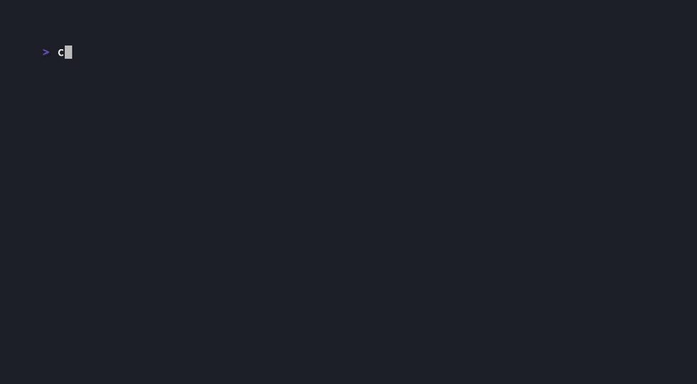

<h1>&nbsp;CTGuard</h1>

<div align="center">
  <p><strong>Static analyzer that catches timing side-channel vulnerabilities in Go.</strong></p>

  [](https://github.com/oasilturk/ctguard/actions/workflows/ci.yml)
  [](https://goreportcard.com/report/github.com/oasilturk/ctguard)
  [](https://github.com/oasilturk/ctguard/actions/workflows/ci.yml)
  [](https://pkg.go.dev/github.com/oasilturk/ctguard)
  [](https://opensource.org/licenses/MIT)
</div>

<br>

CTGuard uses SSA-based taint tracking to find code paths where secret data leaks through execution timing. It catches comparisons with `==`, branches on private keys, secret-dependent indexing, and more.

<p align="center">
  
</p>

## Getting Started

### Install

**macOS / Linux**

```bash
brew install oasilturk/tap/ctguard
```

or

```bash
go install github.com/oasilturk/ctguard/cmd/ctguard@latest
```

**Windows**

```bash
go install github.com/oasilturk/ctguard/cmd/ctguard@latest
```

Pre-built binaries for all platforms are available on the [Releases](https://github.com/oasilturk/ctguard/releases) page.

### Run

Mark secret parameters, then scan:

```go
//ctguard:secret key
func Verify(key []byte, message []byte) bool {
    return bytes.Equal(key, expected) // CTGuard flags this
}
```

```bash
ctguard ./...
```

## Rules

| Rule | Description | Example |
|------|-------------|---------|
| **CT001** | Secret-dependent branching | `if secret == "admin"` |
| **CT002** | Non-constant-time comparison | `bytes.Equal(secret, input)` |
| **CT003** | Secret-dependent indexing | `table[secret[i]]` (cache timing) |
| **CT004** | Secret exposure in logs/errors | `log.Printf("%s", secret)` |
| **CT005** | Variable-time arithmetic | `secret / n`, `secret % n` |
| **CT006** | Secret on channels | `ch <- secret` |
| **CT007** | Secret in I/O sinks | `conn.Write(secret)` in isolated regions |

## Example

```go
//ctguard:secret key
func Check(key string) {
    normalized := strings.ToLower(key)
    if normalized == "admin" {           // CT001: branch depends on secret
        grantAccess()
    }
}
```

```
auth.go:4:5 CT001: branch depends on secret 'key' (confidence: high)
```

Fix with constant-time operations:

```go
//ctguard:secret key
func Check(key string) {
    normalized := strings.ToLower(key)
    if subtle.ConstantTimeCompare([]byte(normalized), []byte("admin")) == 1 {
        grantAccess()
    }
}
```

```
No issues found
```

## Output Formats

```bash
ctguard ./...                    # Plain text (default)
ctguard -format=json ./...       # JSON
ctguard -format=sarif ./...      # SARIF (GitHub Code Scanning)
```

## CI Integration

### GitHub Actions

```yaml
- uses: oasilturk/ctguard@main
```

### With Code Scanning

```yaml
- uses: oasilturk/ctguard@main
  with:
    format: sarif
    args: "-fail=false ./..."
    sarif-file: ctguard.sarif

- uses: github/codeql-action/upload-sarif@v4
  with:
    sarif_file: ctguard.sarif
```

## Configuration

Create `.ctguard.yaml` in your project root:

```yaml
rules:
  enable: [all]
  disable: [CT003]

exclude:
  - "vendor/**"
  - "**/*_test.go"
```

<details>
<summary>All options</summary>

```yaml
annotations:
  secrets:
    - package: "github.com/vendor/pkg"
      function: "Compare"
      params: ["secret"]
  ignores:
    - package: "github.com/vendor/pkg"
      function: "SafeFunc"
      rules: all

format: json
fail: true
summary: true
min-confidence: low
```

See [.ctguard.yaml.example](.ctguard.yaml.example) for a full reference.

</details>

## Suppressing Findings

```go
//ctguard:ignore CT002 -- constant prefix check, not a timing risk
return strings.HasPrefix(token, "Bearer ")
```

```go
//ctguard:ignore              // all rules
//ctguard:ignore CT001        // specific rule
//ctguard:ignore CT001 CT002  // multiple rules
```

## How It Works

CTGuard integrates with `go vet` as a custom analyzer. It builds an SSA representation of your code, then:

1. Collects `//ctguard:secret` annotations to identify sensitive parameters
2. Performs interprocedural taint tracking (fixed-point iteration across function boundaries)
3. Runs 7 specialized rule checkers against the taint graph
4. Reports findings with confidence levels (high/low) based on taint precision

## Contributing

See [CONTRIBUTING.md](CONTRIBUTING.md) for guidelines and [SECURITY.md](SECURITY.md) for reporting vulnerabilities.

## License

MIT &copy; [oasilturk](https://github.com/oasilturk)
